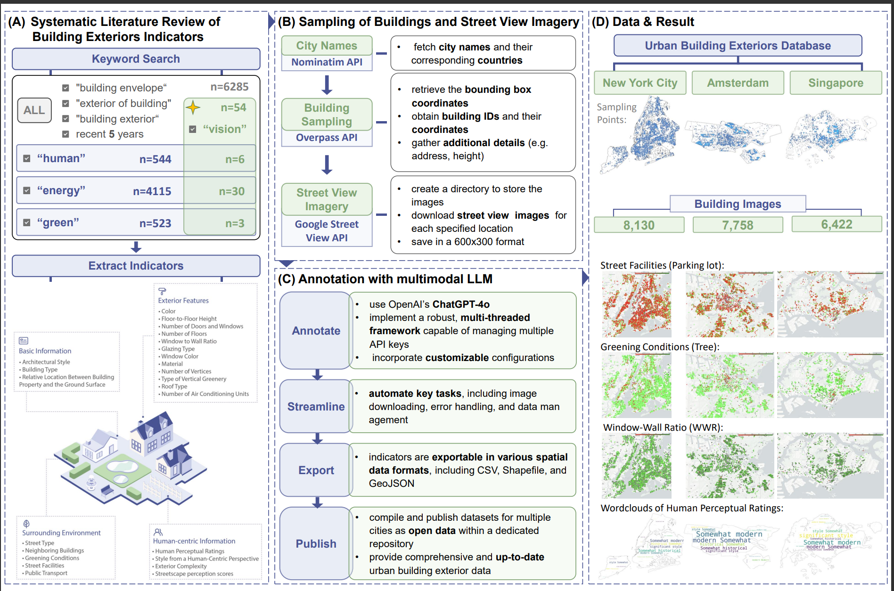

<div align="center">

# BuildingView

### Constructing Urban Building Exteriors Databases with Street View Imagery and Multimodal Large Language Model

[](https://doi.org/10.1007/978-981-95-3102-8_1)
[](https://doi.org/10.1007/978-981-95-3102-8_1)
[](https://www.python.org/)
[](#license)
[](https://github.com/Jasper0122/BuildingView)

**Official implementation for constructing urban building exterior databases from OpenStreetMap, Google Street View imagery, and GPT-4o-based multimodal annotation.**

[Paper](https://doi.org/10.1007/978-981-95-3102-8_1) |
[Installation](#installation) |
[Workflow](#workflow) |
[Usage](#usage) |
[Citation](#citation)

</div>



## News

- **2025-11-12**: BuildingView first appeared online as a SpatialDI 2025 conference paper in *Lecture Notes in Computer Science*, volume 15838.
- **2025**: The paper was published in *Spatial Data and Intelligence* by Springer, Singapore.

## Overview

Urban building exteriors are important for urban analytics, energy efficiency, environmental sustainability, architectural design, and human-centered planning. However, building exterior information is difficult to collect at scale and is often missing from conventional geospatial datasets.

**BuildingView** builds a reproducible workflow for constructing building exterior databases by integrating:

- **OpenStreetMap** building footprints and spatial metadata through the Overpass API
- **Google Street View** imagery for building-level exterior observation
- **GPT-4o multimodal annotation** guided by user-defined building exterior prompts
- **GIS export and mapping** for downstream urban analysis

The repository is aligned with the Springer chapter:

> **BuildingView: Constructing Urban Building Exteriors Databases with Street View Imagery and Multimodal Large Language Model**  
> Zongrong Li, Yunlei Su, Hongrong Wang, Wufan Zhao  
> In: *Spatial Data and Intelligence*, SpatialDI 2025, Lecture Notes in Computer Science, vol. 15838, Springer, Singapore  
> DOI: [10.1007/978-981-95-3102-8_1](https://doi.org/10.1007/978-981-95-3102-8_1)

## Highlights

- **Street-view-based exterior database construction**: Samples building locations and retrieves corresponding Google Street View imagery.
- **OSM-integrated spatial workflow**: Uses Nominatim and Overpass API to query building footprints, coordinates, addresses, and building attributes.
- **Prompt-driven GPT-4o annotation**: Supports customized prompts for extracting building exterior indicators from street-view images.
- **Validated urban case studies**: The paper reports validation using data from New York City, Amsterdam, and Singapore.
- **GIS-ready outputs**: Exports annotated building records to CSV, GeoJSON, and Shapefile.

## Workflow

```text
City / country query or bounding box
  |
  |-- Retrieve OSM building data             Overpass.py / Overpass_bounding_box.py
  |
  |-- Optional sampled-location map          map.py
  |
  |-- Download Google Street View images     StreetView_donloader.py
  |
  |-- Annotate images with GPT-4o            image_processing_pipeline.py / openai.py
  |
  |-- Merge annotations with source records  image_processing_pipeline.py
  |
  `-- Export GIS files                       export_results.py
```

## Repository Structure

```text
BuildingView/
|-- Overpass.py                    # Retrieve OSM building data by city and country
|-- Overpass_bounding_box.py       # Retrieve OSM building data by bounding box
|-- city_country_matcher.py        # Match city queries to city/country names
|-- StreetView_donloader.py        # Download Google Street View images
|-- image_processing_pipeline.py   # Run annotation, retry failures, and merge JSONL files
|-- openai.py                      # GPT-4o image annotation script
|-- map.py                         # Generate sampled-location maps
|-- export_results.py              # Export CSV, GeoJSON, and Shapefile outputs
|-- Buildingview.png               # Workflow figure
|-- prompt.txt                     # User-editable annotation prompt
|-- openai_api_keys.txt            # OpenAI API keys, one per line
`-- requirements.txt
```

## Installation

```bash
git clone https://github.com/Jasper0122/BuildingView
cd BuildingView

conda create -n buildingview python=3.9 -y
conda activate buildingview

pip install -r requirements.txt
```

## API Configuration

BuildingView requires:

- [Google Street View Static API](https://developers.google.com/maps/documentation/streetview)
- [OpenAI API](https://platform.openai.com/docs/)
- Internet access to Nominatim and Overpass API

Place OpenAI API keys in `openai_api_keys.txt`, one key per line:

```text
sk-...
sk-...
```

Edit `prompt.txt` to define the building exterior indicators and output schema you want GPT-4o to extract.

## Usage

### 1. Retrieve Building Data

Search candidate city/country names:

```bash
python city_country_matcher.py "NY"
```

Retrieve buildings by city and country:

```bash
python Overpass.py "New York" "United States" 1000
```

Retrieve buildings by bounding box:

```bash
python Overpass_bounding_box.py "New York" 1000 40.477399 -74.259090 40.917577 -73.700272
```

### 2. Visualize Sampled Locations

```bash
python map.py "Data/New_York_United_States_1000.jsonl"
```

### 3. Download Street View Images

```bash
python StreetView_donloader.py "Data/New_York_United_States_1000.jsonl" "YOUR_GOOGLE_API_KEY"
```

Images are saved in a directory named after the input JSONL file.

### 4. Annotate Building Exteriors

```bash
python image_processing_pipeline.py \
  "GoogleStreetViewImages/New_York_United_States_1000" \
  "prompt.txt" \
  "openai_api_keys.txt"
```

The pipeline:

- Runs `openai.py` on street-view images
- Logs failed images
- Retries failed requests
- Merges labels back into the source JSONL records
- Saves merged results under `result/`

### 5. Export Results

```bash
python export_results.py "result/New_York_United_States_1000.jsonl"
```

The script exports:

- CSV
- GeoJSON
- Shapefile

## Outputs

BuildingView produces:

- Building-level JSONL records from OSM and Overpass
- Google Street View image collections
- GPT-4o building exterior annotations
- Merged building exterior databases
- GIS-ready exports for mapping and analysis

## Relationship to BuildingMultiView

BuildingView focuses on **street-view-based building exterior annotation**. The follow-up project [BuildingMultiView](https://github.com/ai4city-hkust/buildingmultiview) extends this idea to multi-perspective imagery by combining satellite house, satellite neighborhood, and street-view branches for multi-scale building characterization.

## Citation

If you find this repository useful, please cite:

```bibtex
@inproceedings{li2026buildingview,
  title     = {BuildingView: Constructing Urban Building Exteriors Databases with Street View Imagery and Multimodal Large Language Model},
  author    = {Li, Zongrong and Su, Yunlei and Wang, Hongrong and Zhao, Wufan},
  booktitle = {Spatial Data and Intelligence},
  series    = {Lecture Notes in Computer Science},
  volume    = {15838},
  pages     = {1--19},
  publisher = {Springer},
  address   = {Singapore},
  year      = {2026},
  doi       = {10.1007/978-981-95-3102-8_1}
}
```

## Contact

For questions about the code or paper, please contact **Wufan Zhao** at [wufanzhao@hkust-gz.edu.cn](mailto:wufanzhao@hkust-gz.edu.cn).

## License

This project is released under the [MIT License](LICENSE).
